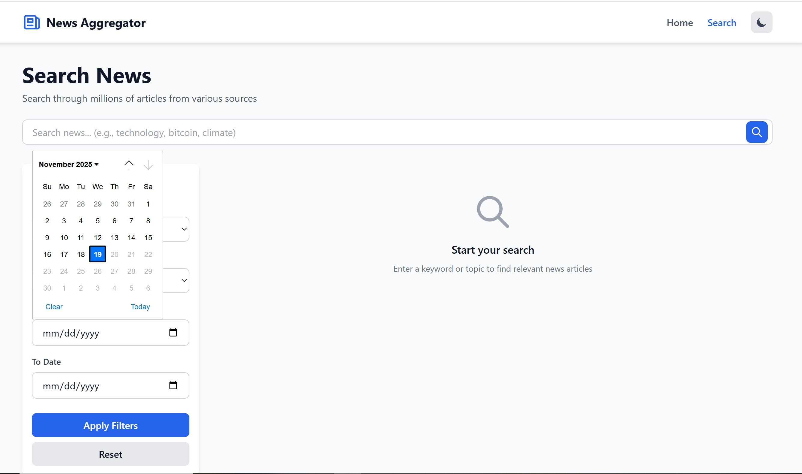
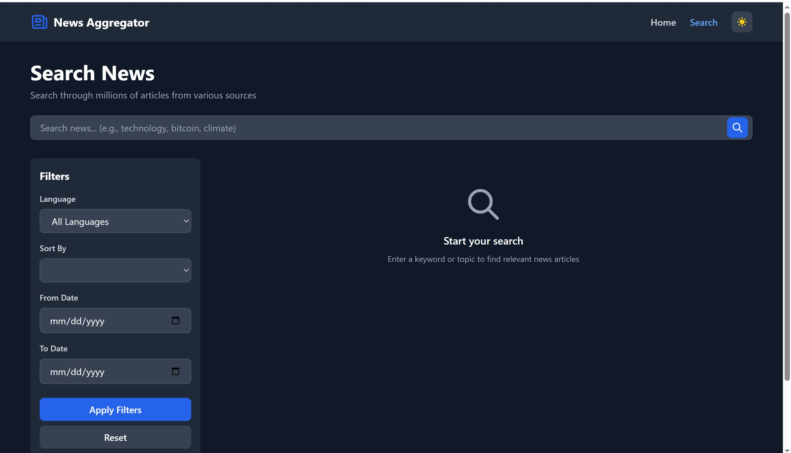

# News Aggregator

A modern, full-stack web application for browsing and searching news from around the world. Built with React, FastAPI, and TailwindCSS, powered by NewsAPI.org.


## Screenshots

### Homepage - Light Mode

*Homepage featuring skeleton loading states and responsive card layout*

### Search Page - Light Mode

*Advanced search with date picker and comprehensive filters*

### Search Page - Dark Mode

*Beautiful dark mode with filter sidebar and modern UI*

### Key Highlights
- ✨ **Modern & Clean Design** - Intuitive interface with smooth animations
- 🌓 **Dark Mode Support** - Seamless theme switching with local storage persistence
- 📱 **Fully Responsive** - Mobile-first design that works on all screen sizes
- ⚡ **Fast Loading** - Skeleton loaders and optimized performance
- 🔍 **Advanced Filters** - Date range, language, categories, and sorting options
- 🎨 **Professional UI** - Built with TailwindCSS for consistent styling

## Features

### Core Functionality
- **Top Headlines**: Browse latest news from various categories
- **Advanced Search**: Search news by keywords with powerful filters
- **Category Filters**: Filter by business, technology, sports, and more
- **Language Support**: Multi-language news articles
- **Date Range**: Filter news by date range
- **Pagination**: Easy navigation through large result sets
- **Responsive Design**: Mobile-first, works on all devices
- **Dark Mode**: Toggle between light and dark themes
- **Fast Performance**: Intelligent caching (3-minute TTL)

### Technical Highlights
- **Modern UI**: Built with React 18 and TailwindCSS
- **Type-Safe API**: FastAPI with Pydantic validation
- **RESTful Architecture**: Clean separation of concerns
- **Comprehensive Testing**: Unit and integration tests
- **Production Ready**: Error handling, loading states, and edge cases covered
- **API Key Security**: Never exposed to the frontend

## Tech Stack

### Backend
- **FastAPI** - Modern Python web framework
- **Pydantic** - Data validation
- **httpx** - Async HTTP client
- **cachetools** - Response caching
- **pytest** - Testing framework

### Frontend
- **React 18** - UI library
- **Vite** - Build tool and dev server
- **React Router** - Client-side routing
- **TailwindCSS** - Utility-first CSS
- **Axios** - HTTP client

## Prerequisites

- **Python 3.11+** (3.9+ should work)
- **Node.js 18+** and npm
- **NewsAPI Key** (free from [newsapi.org](https://newsapi.org/register))

## Installation & Setup

### 1. Clone the Repository

```bash
git clone https://github.com/Aliipou/news-hub/
cd news-app2
```

### 2. Backend Setup

```bash
# Navigate to backend directory
cd backend

# Create virtual environment
python -m venv venv

# Activate virtual environment
# On Windows:
venv\Scripts\activate
# On macOS/Linux:
source venv/bin/activate

# Install dependencies
pip install -r ../requirements.txt

# Configure environment variables
# Edit backend/.env and add your NewsAPI key
# Replace 'your_api_key_here' with your actual API key
```

**Important**: Get your free API key from [NewsAPI.org](https://newsapi.org/register) and update `backend/.env`:

```env
NEWS_API_KEY=your_actual_api_key_here
```

### 3. Frontend Setup

```bash
# Navigate to frontend directory (from project root)
cd frontend

# Install dependencies
npm install

# Configure environment variables (already set for local development)
# frontend/.env should contain:
# VITE_API_BASE_URL=http://localhost:8000
```

## Running the Application

### Start Backend Server

```bash
# From backend directory
cd backend
# Make sure virtual environment is activated
python -m uvicorn main:app --reload --host 0.0.0.0 --port 8000
```

Backend will run at: **http://localhost:8000**

API Documentation: **http://localhost:8000/docs**

### Start Frontend Server

```bash
# From frontend directory (in a new terminal)
cd frontend
npm run dev
```

Frontend will run at: **http://localhost:5173**

### Access the Application

Open your browser and navigate to:
- **Frontend**: http://localhost:5173
- **API Docs**: http://localhost:8000/docs
- **API Health**: http://localhost:8000/health

## Testing

### Backend Tests

```bash
cd backend

# Run all tests
pytest

# Run with coverage
pytest --cov=backend --cov-report=html

# Run specific test file
pytest tests/test_news_api.py
pytest tests/test_routers.py
```

### Test Coverage

The backend includes comprehensive tests:
- ✅ NewsAPI service unit tests
- ✅ Router endpoint tests
- ✅ Error handling tests
- ✅ Pagination tests
- ✅ Cache functionality tests
- ✅ Input validation tests

## API Endpoints

### Headlines
```http
GET /api/headlines?country=us&category=technology&page=1&page_size=10
```

**Query Parameters:**
- `country` (optional): 2-letter country code (e.g., us, gb, ca)
- `category` (optional): business, entertainment, general, health, science, sports, technology
- `page` (optional, default: 1): Page number
- `page_size` (optional, default: 10): Articles per page (max 100)

### Search
```http
GET /api/search?q=bitcoin&language=en&sortBy=publishedAt&page=1
```

**Query Parameters:**
- `q` (required): Search keyword
- `language` (optional): 2-letter language code (e.g., en, es, fr)
- `from` (optional): Start date (YYYY-MM-DD)
- `to` (optional): End date (YYYY-MM-DD)
- `sortBy` (optional): relevancy, popularity, publishedAt
- `page` (optional, default: 1)
- `page_size` (optional, default: 10)

### Filters
```http
GET /api/filters
```

Returns available filter options (categories, languages, countries, sort options).

### Health Check
```http
GET /health
```

Returns API health status.

## Project Structure

```
news-app2/
├── backend/
│   ├── main.py                 # FastAPI app
│   ├── routers/               # API endpoints
│   │   ├── headlines.py
│   │   ├── search.py
│   │   └── filters.py
│   ├── services/              # Business logic
│   │   └── news_api.py
│   ├── models/                # Pydantic models
│   │   ├── article.py
│   │   └── filters.py
│   ├── utils/                 # Utilities
│   │   ├── config.py
│   │   └── cache.py
│   ├── tests/                 # Test suite
│   │   ├── test_news_api.py
│   │   └── test_routers.py
│   └── .env                   # Environment config
├── frontend/
│   ├── src/
│   │   ├── components/        # React components
│   │   │   ├── common/
│   │   │   ├── news/
│   │   │   ├── search/
│   │   │   └── pagination/
│   │   ├── pages/             # Page components
│   │   │   ├── HomePage.jsx
│   │   │   └── SearchPage.jsx
│   │   ├── services/          # API client
│   │   ├── hooks/             # Custom hooks
│   │   ├── utils/             # Helpers
│   │   └── App.jsx
│   ├── public/
│   └── .env
├── requirements.txt
├── .gitignore
├── ARCHITECTURE.md
└── README.md
```

## Configuration

### Backend Configuration (backend/.env)

```env
NEWS_API_KEY=your_api_key_here
APP_NAME=News Aggregator API
APP_VERSION=1.0.0
DEBUG=true
CORS_ORIGINS=http://localhost:3000,http://localhost:5173
CACHE_TTL=180
DEFAULT_PAGE_SIZE=10
MAX_PAGE_SIZE=100
```

### Frontend Configuration (frontend/.env)

```env
VITE_API_BASE_URL=http://localhost:8000
```

## Key Features Explained

### Caching System
- Responses are cached for 3 minutes (configurable)
- Reduces API calls to NewsAPI (free tier: 100 requests/day)
- Cache key based on endpoint + parameters
- Automatic TTL expiration

### Dark Mode
- Persisted in localStorage
- Smooth transitions
- Respects system preferences (optional)

### Responsive Design
- Mobile-first approach
- Breakpoints: sm (640px), md (768px), lg (1024px), xl (1280px)
- Fluid typography and spacing

### Error Handling
- User-friendly error messages
- Retry functionality
- Network error detection
- API error handling

## Deployment

### Backend Deployment (Render.com)

1. Create a new Web Service on Render
2. Connect your GitHub repository
3. Set build command: `pip install -r requirements.txt`
4. Set start command: `uvicorn backend.main:app --host 0.0.0.0 --port $PORT`
5. Add environment variable: `NEWS_API_KEY`
6. Deploy!

### Frontend Deployment (Vercel)

1. Import project to Vercel
2. Set root directory to `frontend`
3. Framework preset: Vite
4. Add environment variable: `VITE_API_BASE_URL` (your backend URL)
5. Deploy!

## Troubleshooting

### Backend Issues

**Issue**: `ModuleNotFoundError: No module named 'backend'`
**Solution**: Make sure you're running commands from the correct directory and virtual environment is activated.

**Issue**: `Invalid API key` error
**Solution**: Verify your NewsAPI key in `backend/.env` is correct.

**Issue**: `Rate limit exceeded`
**Solution**: Wait a bit or upgrade to a paid NewsAPI plan.

### Frontend Issues

**Issue**: CORS errors
**Solution**: Ensure backend CORS_ORIGINS includes frontend URL.

**Issue**: `Failed to fetch` errors
**Solution**: Check that backend server is running on http://localhost:8000

**Issue**: Dark mode not persisting
**Solution**: Check browser localStorage is enabled.

## Contributing

Contributions are welcome! Please follow these steps:

1. Fork the repository
2. Create a feature branch (`git checkout -b feature/amazing-feature`)
3. Commit your changes (`git commit -m 'Add amazing feature'`)
4. Push to the branch (`git push origin feature/amazing-feature`)
5. Open a Pull Request

## License

This project is open source and available under the MIT License.

## Acknowledgments

- [NewsAPI.org](https://newsapi.org/) for providing the news data
- [FastAPI](https://fastapi.tiangolo.com/) for the amazing framework
- [React](https://react.dev/) for the UI library
- [TailwindCSS](https://tailwindcss.com/) for the styling system

## Contact

For questions or feedback, please open an issue on GitHub.

---

**Built with ❤️ using React, FastAPI, and TailwindCSS**
